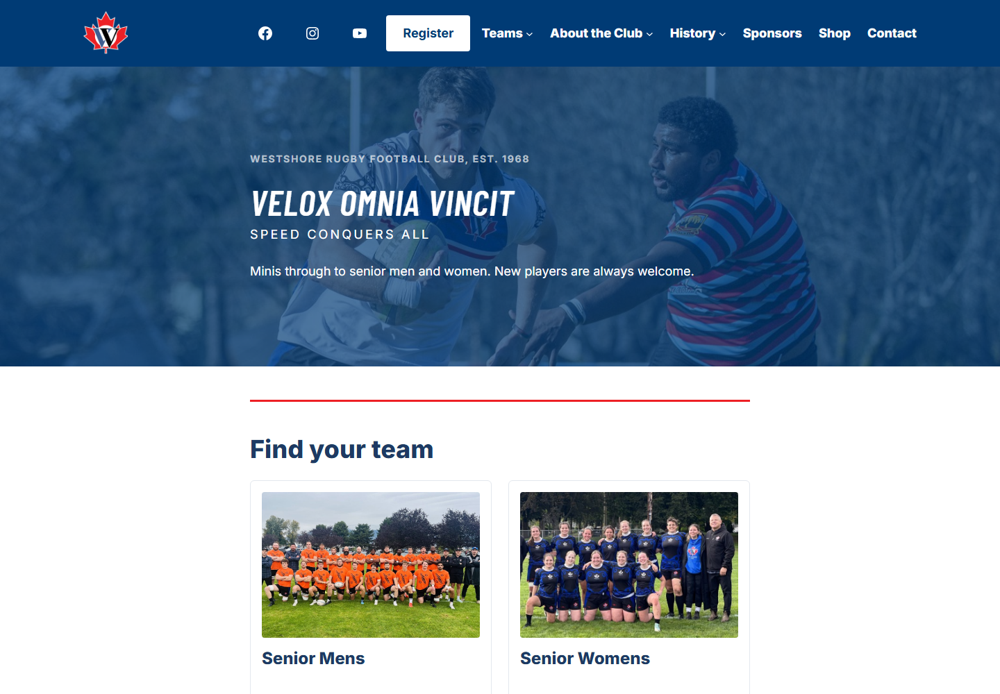
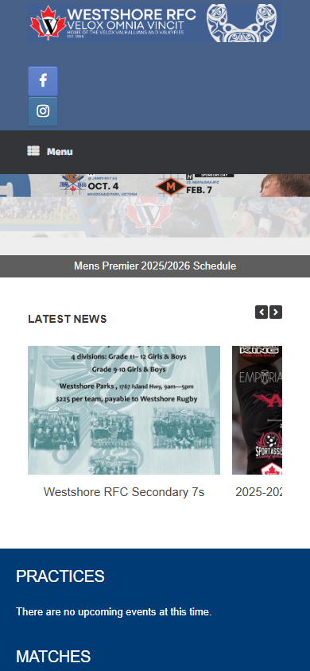
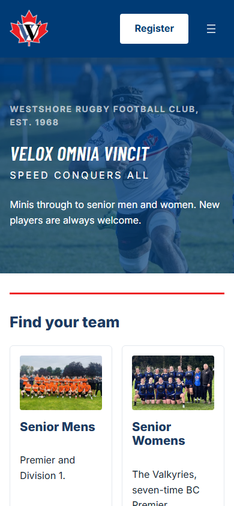

# Westshore Rugby site

The WordPress theme and plugin for the new [westshorerfc.com](https://westshorerfc.com), the site for Westshore Rugby Football Club in Colwood, BC. I rebuilt it in September 2026 as a volunteer. It's finished on staging and goes live once the club signs off.

On a phone, before and after:

| Before | After |
| --- | --- |
|  |  |

## The problem

The club ran on a 2015 theme and a page builder. About 72% of visitors arrive on a phone in season, and on a phone the header and menu took almost half the first screen. Volunteers kept the site up, and every fact was typed by hand: training times, fees, coaches' phone numbers. The same registrar's details sat on four pages, so a change meant four edits and one always got missed. The fixtures were a JPEG of a schedule.

Under that, the server had its own problems. The nightly backup had written an empty folder every night for ten days, and nothing logged it.

## What's here

**`themes/westshore/`** is a block theme. It's mobile first, and colours, type and spacing live in `theme.json`, so they can be changed from the admin without code.

- 18 block patterns. Volunteers insert a finished layout and edit the text and photos. The structure is locked so it can't be broken by accident.
- The palette is taken from the club's crest and measured for contrast. The crest red is 4.35:1 on white, which fails WCAG AA for text, so it's only used for rules and markers. A darker red at 6.04:1 is used where a button has to be red.
- `functions.php` works around a few core gaps. One example: a locked cover block only lets you change the image URL, so a volunteer could swap the photo but keep the old alt text. A filter marks `alt` and `focalPoint` as editable content too.

**`plugins/westshore-core/`** holds the club's data, kept separate from the theme so a future redesign can't take it along.

- **Sponsors and people** as custom post types, with tiers and groups. A coach or board member is entered once and appears on every page that lists them. Contact details are opt-in per page.
- **Season facts** (season year, fees, ground, training times) live in one settings screen and reach pages through shortcodes. Next season is one edit, not twelve.
- **Live fixtures, results and ladders from Play HQ**, the league's registration system. It uses the Canadian API host, which isn't documented anywhere obvious, and fetches server-side so the API key never reaches the browser. Responses are cached for an hour, and the last good copy is kept. If Play HQ goes down, the site shows the last fixtures it had instead of an error.
- **YouTube streams and an Instagram feed**, wrapped so an unconfigured or failing feed prints nothing rather than a plugin error.
- **Redirects** for retired pages, so old links and search results still land in the right section.

## How it was done

I planned the work in phases and built all of it on a staging copy first. Production doesn't change until a scripted cutover with a written runbook and a rehearsed rollback.

- **Nothing overwrites a volunteer's edit.** The migration scripts that converted about 30 pages from the page builder store a hash of what they wrote. If someone later edits that page in the admin, the next run sees the mismatch and skips it.
- **Every write script dry-runs by default** and reports what it would change. Only an explicit `apply` writes.
- **Verified by diff, not by eye.** Plugin refactors were checked by capturing every page's HTML before and after and diffing it. The capture strips the parts that change on every request.
- **The backups.** Cron runs with a minimal `PATH`, and on this host that picks a PHP build wp-cli refuses to run under. It worked from a shell and failed silently on the schedule. The fix names the PHP binary explicitly, and an error trap logs the failing line so the next failure shows up in one grep.

The deploy scripts, migration scripts and ops notes are in a private repo because they describe the club's server.

## Stack

WordPress 6.5+, PHP 8.0+ (staging on 8.3), a block theme with no build step and no JavaScript framework. Barlow Condensed and Inter, self-hosted.

## Licence

GPL-2.0-or-later, as WordPress requires. The Westshore name, crest and wordmark belong to the club and aren't covered by the licence. The fonts are under the SIL Open Font License.
